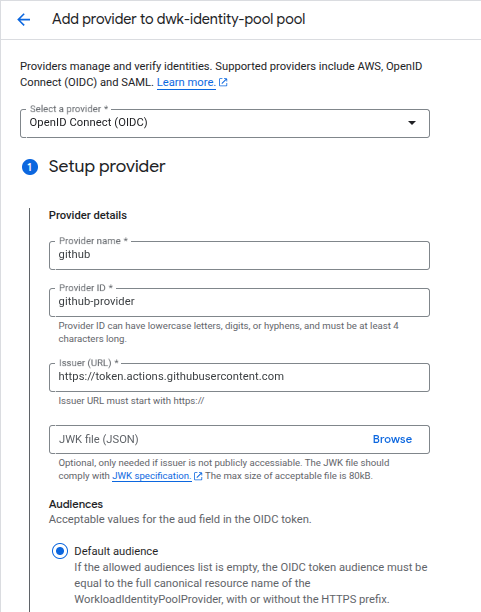
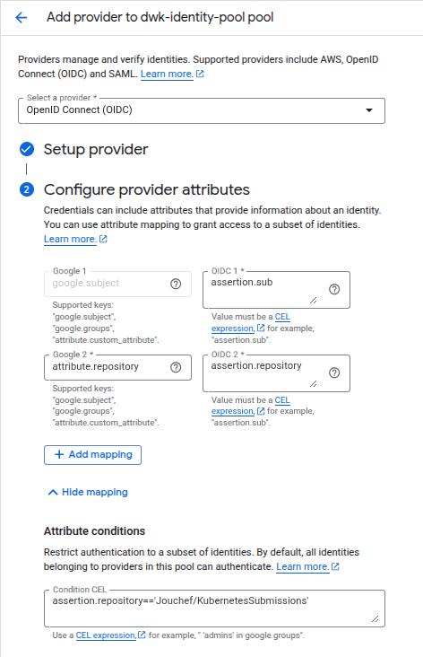
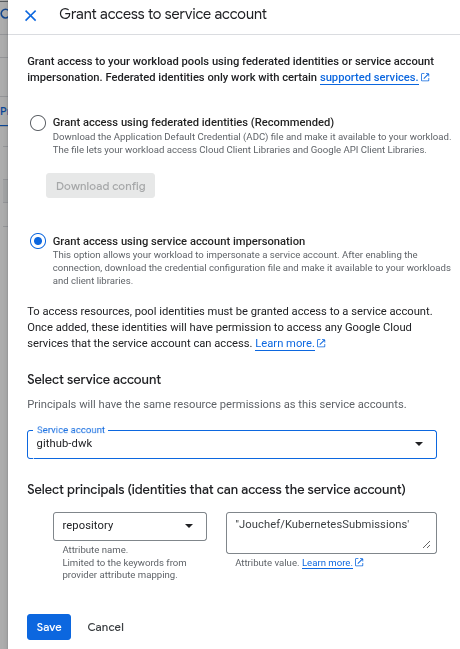

# Kubernetes submissions

## Exercises

### CHAPTER 2
- [1.1](https://github.com/Jouchef/KubernetesSubmissions/tree/1.1/Log_output)
- [1.2](https://github.com/Jouchef/KubernetesSubmissions/tree/1.2/todo_app)
- [1.3](https://github.com/Jouchef/KubernetesSubmissions/tree/1.3/Log_output)
- [1.4](https://github.com/Jouchef/KubernetesSubmissions/tree/1.4/todo_app)
- [1.5](https://github.com/Jouchef/KubernetesSubmissions/tree/1.5/todo_app)
- [1.6](https://github.com/Jouchef/KubernetesSubmissions/tree/1.6/todo_app)
- [1.7](https://github.com/Jouchef/KubernetesSubmissions/tree/1.7/Log_output)
- [1.8](https://github.com/Jouchef/KubernetesSubmissions/tree/1.8/todo_app)
- [1.9](https://github.com/Jouchef/KubernetesSubmissions/tree/1.9/pingpong) 
- [1.10](https://github.com/Jouchef/KubernetesSubmissions/tree/1.10/Log_output)
- [1.11](https://github.com/Jouchef/KubernetesSubmissions/tree/1.11/Log_output)
- [1.12](https://github.com/Jouchef/KubernetesSubmissions/tree/1.12/todo_app)
- [1.13](https://github.com/Jouchef/KubernetesSubmissions/tree/1.13/todo_app)

### CHAPTER 3
- [2.1](https://github.com/Jouchef/KubernetesSubmissions/tree/2.1/Log_output)
- [2.2](https://github.com/Jouchef/KubernetesSubmissions/tree/2.2/todo_app)
- [2.3](https://github.com/Jouchef/KubernetesSubmissions/tree/2.3/Log_output)
- [2.4](https://github.com/Jouchef/KubernetesSubmissions/tree/2.4/todo_app)
- [2.5](https://github.com/Jouchef/KubernetesSubmissions/tree/2.5/Log_output)
- [2.6](https://github.com/Jouchef/KubernetesSubmissions/tree/2.6/todo_app)
- [2.7](https://github.com/Jouchef/KubernetesSubmissions/tree/2.7/pingpong) 
- [2.8](https://github.com/Jouchef/KubernetesSubmissions/tree/2.8/todo_app)
- [2.9](https://github.com/Jouchef/KubernetesSubmissions/tree/2.9/todo_app)
- [2.10](https://github.com/Jouchef/KubernetesSubmissions/tree/2.10/todo_app)

### CHAPTER 4
- [3.1](https://github.com/Jouchef/KubernetesSubmissions/tree/3.1/pingpong) 
- [3.2](https://github.com/Jouchef/KubernetesSubmissions/tree/3.2/Log_output)
- [3.3](https://github.com/Jouchef/KubernetesSubmissions/tree/3.3/Log_output)
- [3.4](https://github.com/Jouchef/KubernetesSubmissions/tree/3.4/pingpong)
- [3.5](https://github.com/Jouchef/KubernetesSubmissions/tree/3.5/todo_app)
- [3.6](https://github.com/Jouchef/KubernetesSubmissions/tree/3.6/todo_app)
- [3.7](https://github.com/Jouchef/KubernetesSubmissions/tree/3.7/todo_app)
- [3.8](https://github.com/Jouchef/KubernetesSubmissions/tree/3.8/todo_app)
- [3.9](https://github.com/Jouchef/KubernetesSubmissions/tree/3.8?tab=readme-ov-file#Exercise-3.9-DBaaS-vs-DIY)


## Commands

### K3D
| Command                                    | about                              |
| ------------------------------------------ | ---------------------------------- |
| k3d cluster start / stop                   | Start ands stops current cluster   |
| k3d image import                           | Import docker image to the cluster |
| k3d cluster create / delete / list /  edit | Modify cluster in some manner      |

### Kubectl
| Command                                                           | about                                                                                                                                    |
| ----------------------------------------------------------------- | ---------------------------------------------------------------------------------------------------------------------------------------- |
| kubectl config use-context CLUSTERNAME                            | Change context to other cluster                                                                                                          |
| kubectl explain RESOURCE                                          | Get explanation to the resource                                                                                                          |
| kubectl describe RESOURCE RESOURCENAME                            | shows all specs of the resource                                                                                                          |
| kubectl get RESOURCE                                              | List all objects of that type. Use `--watch` flag if you want it to update                                                               |
| kubectl logs -f PODNAME                                           | see the output of the pod                                                                                                                |
| `kubectl logs DEPLOYMENT-NAME -c CONTAINER-NAME`                  | Use this to see container logs when deployment has multiple of them. Use `--previous` flag to see the logs of the last crashed container |
| kubectl delete deployment DEPNAME                                 | Delete the deployment                                                                                                                    |
| kubectl apply -f FILEPATH-TO-YAML                                 | create or modify deployment / service according to the YAML                                                                              |
| kubectl config view --minify --raw                                | get kubeconfig for example to use with lens                                                                                              |
| kubectl port-forward PODNAME LOCALPORT:APPPORT                    | Create temporary access to software for example debugging purposes                                                                       |
| kubectl create secret generic SECRETNAME --from-env-file=.env     | Use your .env file to bring secret to the cluster                                                                                        |
| kubectl create secret generic SECRETNAME --from-literal=KEY=VALUE | Save variable to the cluster. After this add details to the deployment configuration yaml.                                               |
| kubectl get deployment DEPNAME -o yaml                            | Get the deployments info in yaml format.                                                                                                 |
| kubectl exec -it PODNAME -- printenv                              | See all variables used in pod. Can be used with grep command                                                                             |
| kubectl rollout restart deployment DEPNAME                        | Restart a deployment when envs updated.                                                                                                  |
| kubectl exec -it DEPLOYMENTNAME -- bash                           | Run commands inside the deployment for troubleshooting                                                                                   |
| wget -qO - http://SERVICENAME:SERVICEPORT                         | From inside of an another pod you can connect to anothor pod inside the same cluster if you have ClusterIp service defined.              |
| kubectl config set-context --current --namespace=<name>           | If you want to use specific namespace contantly use this command to change default namespace.                                            |
| kubectl create namespace                                          | create new namespace                                                                                                                     |
| `kubectl config get-contexts`                                     | List all possible contexts (GKE, local,...)                                                                                              |
| `kubectl config use-context NAME`                                 | Change the contexts to NAME                                                                                                              |


### Docker
| Command                     | About                                                                                                      |
| --------------------------- | ---------------------------------------------------------------------------------------------------------- |
| docker exec -it NODENAME sh | Inspect specific Node. In this course this was used to check file status when troubleshooting DB problems. |


### Virtual Env
| Command                       | About                                                                  |
| ----------------------------- | ---------------------------------------------------------------------- |
| python3 -m venv venv          | Create virtual environment including python and pip.                   |
| source venv/bin/activate      | Activate virtual environment in terminal.                              |
| pip install DEPENDENCY        | Install dependency to the virtual environment.                         |
| pip freeze > requirements.txt | Create requirements.txt file that Dockerfile needs for image building. |
| deactivate                    | Escape pip virtual environment.                                        |

### Kubens - Manage Namespaces
Install it with apt or other
| Command          | About                                            |
| ---------------- | ------------------------------------------------ |
| kubens           | List Namespaces in active cluster.               |
| kubens NAMESPACE | Change the namespace to the specified namespace. |

### psql
```pip install psycopg2-binary```
| Command                              | About                                           |
| ------------------------------------ | ----------------------------------------------- |
| psql -U POSTGRES_USER -d POSTGRES_DB | Use postgres when you have exec'd into the pod. |
| \l                                   | List databases                                  |
| \c DATABASENAME                      | Connect to specific database.                   |
| \dt                                  | list tables                                     |
| \d TABLENAME                         | Show table info                                 |

### Helm - the package amanger for kubernetes
| Command                            | About                            |
| ---------------------------------- | -------------------------------- |
| helm repo add REPONAME REPOADDRESS | Add repository to download from. |
| helm repo update                   | Update Helms repo info.          |

### Google cloud - GKE (Google Kubernetes Engine)
[Google's own cheat sheet](https://docs.cloud.google.com/sdk/docs/cheatsheet)
[Here is the latest gcloud CLI version](https://docs.cloud.google.com/sdk/gcloud)
- If you do not use the latest one there might be errors.
- I have installed the .tar package so I have to use the integrated tool to update the CLI
[Here is the suppot schedule for GKE versions](https://docs.cloud.google.com/kubernetes-engine/docs/release-schedule)
| Command                                                                                                | About                                                                      |
| ------------------------------------------------------------------------------------------------------ | -------------------------------------------------------------------------- |
| `gcloud init`                                                                                          | Initialize gcloud CLI                                                      |
| `gcloud -v`                                                                                            | Show current CLI version                                                   |
| `gcloud components update`                                                                             | Update the CLI (if you installed the .tar version) Dont use the `sudo` cmd |
| `gcloud auth login`                                                                                    | Login to your account.                                                     |
| `gcloud components list`                                                                               | List all components and their status                                       |
| `gcloud projects list`                                                                                 | Get active projects from the authenticated user                            |
| `gcloud config set project PROJECT_ID`                                                                 | Set the project ID                                                         |
| `gcloud container clusters get-credentials dwk-cluster --zone=europe-north1-b`                         | Credentials if auth plugin was not installed                               |
| `gcloud container clusters delete dwk-cluster --zone=europe-north1-b`                                  | Delete your cluster when not in use.                                       |
| `gcloud container clusters update dwk-cluster --zone=europe-north1-b --monitoring=NONE --logging=NONE` | Save RAM by deleting monitoring and logging                                |

`gcloud container clusters create dwk-cluster --zone=europe-north1-b --release-channel=regular --disk-size=32 --num-nodes=3 --machine-type=e2-micro --gateway-api=standard --monitoring=NONE --logging=NONE`
- Create model cluster as in coursematerial. This also includes the gateway-api.
- `release-channel` has been set to `regular` instead of defining static version for the cluster.
- This will point the kubeconfig to the created cluster
- Monitoring and logging flags disable google cloud's own services. This saves RAM on the cluster as there will not be own pods for those services. 

### Kustomize
Kubectl integrated tool that enables yaml-file customization. It kind of sits on top of other yaml-files over writing their settings.
[Kustomize cheat sheet](https://itnext.io/kubernetes-kustomize-cheat-sheet-8e2d31b74d8f)
| Command               | About                                             |
| --------------------- | ------------------------------------------------- |
| `kubectl apply -k .`  | Apply changes to cluster with customization       |
| `kubectl kustomize .` | See modified yaml files without implementing them |

## Key concepts

### Part II

- **cluster:** group of nodes / containers (server or agent)
- **deployment:** resource that controls pods creation, updating and scaling
- **Resource:** pod, service (svc), node, deployment, PV, PVC, namespace
- **Nodeport:** Port that is available outside. It has to be between 30080 - 32767
- **Service:** Ensures that application is accessible and secured. Handles routing, load balancing... 
- **pod:** Pod can have one or multiple containers running inside of it. 
- **Ingress:** Ingress is a resource that handles routing to the running services inside of a cluster according to the set rules.
- **PersistentVolume (PV):** Defines space for filestorage. Can be stored in different storage mediums. Pods can claim these with *PVC's*
- **PersistentVolumeClaim (PVC):** This allows a pod to claim storagespace from a PV.


### Part III
- **Namespace** Virtual cluster inside of a cluster. With namespace it is possible to divide cluster to smaller logical sections so other software does not interfere with another.
- **ConfigMap** Used to store configuration variables for the application. Changes in configMap reflect instantly in the running application.
- **Secrets** Used to store sensitive information for example API keys.
- **StatefulSet** Like a deployment, but when restarting or crashing they keep their state. Good for DB's 


### Part IV
- **Gateway** Is based on Ingress, but offers more advanced features. 


## Problems and and how I fixed them
- Suddenly could not pull image from Dockerhub when deploying the application. Did work earlier. Pulling with Docker commands worked. 
  - Errors: 
    - ```ImagePullBackOff```, 
    - ```failed to do request: Head "https://registry-1.docker.io/v2/jouchef/log_creator/manifests/1.10.1": dial tcp: lookup registry-1.docker.io: Try again```
  - Fix: ```k3d cluster stop CLUSTER``` ```k3d cluster start CLUSTER```
  - This fixed the problem for me. 
- If you want to update pvc and connect it to the old pv, but ```kubectl get pv``` shows "Released" instead of "Available" on the **status** \
  you can use ```kubectl patch pv PVNAME -p '{"spec":{"claimRef": null}}'``` This command releases the pv from the old pvc and sets **status** to Available.
- If your computer does not have pg_config you need to install psycopg2-binary instead of psycopg2
- After Helm install command
  - ```Error: UPGRADE FAILED: cannot patch "minio" with kind PersistentVolumeClaim: PersistentVolumeClaim "minio" is invalid: spec: Forbidden: spec is immutable after creation except resources.requests and volumeAttributesClassName for bound claims```
    - Use ```kubectl get pvc``` and delete the old pvc
- If you kill the helm install when it is still installing you may get:
  - ```Error: UPGRADE FAILED: another operation (install/upgrade/rollback) is in progress```
    - Use ```helm uninstall CHARTNAME```
      - Chartname is the same one that you have ```ctrl + c``` to.
- Getting a lot of `grafana failed to create fsnotify watcher: too many open files` errors in grafana?
  - You may alter your computer s configuration to up the limit:
    - `sudo nano /etc/sysctl.d/99-inotify.conf`
    - Add the following rows:

```bash
fs.inotify.max_user_instances = 8192
fs.inotify.max_user_watches = 524288
```

     -  Next apply the changes: ```sudo sysctl --system```
-  When applying statefulset: 
   -  `The StatefulSet "todo-postgres-stset" is invalid: spec: Forbidden: updates to statefulset spec for fields other than 'replicas', 'ordinals', 'template', 'updateStrategy',     'persistentVolumeClaimRetentionPolicy' and 'minReadySeconds' are forbidden`
   -  You need to delete the old one without deleting data:
      -  `kubectl delete statefulset STATEFULSET -n NAMESPACE --cascade=orphan`
      -  Cascade flag leaves the data and pods to wait for the creation of the new statefulset
-  CTRL + C accidentally when GKE cluster was creating
   -  Check cluster status with
      -  `gcloud container clusters list`
      -  If status is PROVISIONING, just wait
      -  When ready get the credentials manually
         -  `gcloud container clusters get-credentials dwk-cluster --zone europe-north1-b`
-  When monitoring the website `kubectl logs -l app=server -c backend-container -f`
   -  These `35.191.233.50 - - [11/Jan/2026 15:46:23] "GET / HTTP/1.1" 404 -` are Google healthchecks
      -  By default they are done to the address /. In my case they should be done to /todos
   -  I created healthcheck.yaml to tell Google healthcheck the right address. 

 
## Monitoring setup

_I decided to install monitoring setup in the modern way and not to learn old tools._

### Overview
It consists of:
- Minio
  - Acts as object storage for Loki.
  - inside of Minio needs to be configured the following buckets:
    - admin, chunks, ruler
    - Loki uses these by default to store data.
- Loki
  - Is responsible for gathering, indexing and saving logs _(in this case)_ to the Minio storage.
  - Loki gets the logs from the Grafana Alloy.
  - Logs are saved to the Minio storage as configured in values-minio.yaml.
    - After succesfull installation of Minio you get the url in the info.
    - Below the line _MinIO can be accessed via port 9000 on the following DNS name from within your cluster:_
      - For me it was: ```SERVICENAME.NAMESPACE.cluster.local```
- Grafana Alloy
  - Alloy's role is to gather the logs from the clusters pods and send them to the Loki.
    - After succesfull instlalation of Loki you can get the url to send data from Alloy after the line:
      - _You can send logs from inside the cluster using the cluster DNS:_
        - For me it was: ```http://loki-gateway.NAMESPACE.svc.cluster.local/loki/api/v1/push```
- Grafana
  - Ui to acces the data. Create Dashboards and alerts.
  - Is connected to Loki from which it gets it's data. 
  - Read the info after installation to get your password to the admin panel.
  - Username should be: **admin** and it also reads in the info after install. 
  - Use ```kubectl port-forward GRAFANAPODNAME 3000```
  - And then go the the grafana page in [localhost:3000](localhost:3000)

### Installation

My cluster has been setup using Helsinki university Mooc "Devops with kubernetes course" (30.08.2025)

#### Requirements
- Kubernetes cluster k3s
- Helm 3.x
- Kubectl


1. Create namespaces: `kubectl create namespace NAME`
   1. minio
   2. loki
   3. alloy
   4. grafana
2. Add repositories to the Helm
   
```bash
helm repo add grafana https://grafana.github.io/helm-charts
helm repo add minio https://charts.min.io/
helm repo update
```

3. Navigate to the folder that contains the `values-NAME.yaml` files.
4. Install Minio
   1. ```helm upgrade --install minio minio/minio -n minio -f values-minio.yaml```
      1. use `kubectl port-forward MINIOPODNAME 9001` to use the webui 
      2. dummy username and password are defined in the _values-minio.yaml_-file. 
         1. Change those for your needs and use encryption if possible. 
         2. [instructions for encryption](https://courses.mooc.fi/org/uh-cs/courses/devops-with-kubernetes/chapter-3/configuring-applications)
      3. and create the following buckets
         1. admin, chunks, ruler
5. Install Loki
   1. ```helm upgrade --install loki grafana/loki -n loki -f values-loki.yaml ```
6. Install Alloy
   1. ```helm upgrade --install alloy grafana/alloy -n alloy -f values-alloy.yaml ```
7. Install grafana
   1. ```helm upgrade --install grafana grafana/grafana -n grafana -f values-grafana.yaml ```
      1. Use the `kubectl port-forward GRAFANAPODNAME 3000` to access the web ui. 
      2. Check the Overview - Grafana section on how to get the username and password for login.

## Work instruction for Workload Identity Federation to connect github and Google Cloud

[How to use Github Actions with Google's Workload Identity Federation](https://www.youtube.com/watch?v=ZgVhU5qvK1M)
- the above video explained this well to me.
- Info in the video is partly deprecated when granting access to the pool

- **Pool** manages a group of identities and their access to GC resources. It is like a *keyring*.
- **Provider** issues *keys* to the *keyring*. 
  - Provider can be anyone as long as they support OIDC for example: Github, Azure, AWS...
  - These keys are valid for one time use only and last only specific time.

1. Activate IAM Service Account Credentials API from gcp API Library
2. Go to Workload Identity Pool in GCC and create a new pool
3. Then add a provider, which in this case is [Github](https://docs.github.com/en/actions/how-tos/secure-your-work/security-harden-deployments/oidc-in-google-cloud-platform)
   
4. Configure provider attributes
   
   1. assertion.sub --> google.subject  
      1. Assertion.sub looks like `repo:<github-repository>:environment:<environment>` ([more about environments](https://docs.github.com/en/actions/how-tos/deploy/configure-and-manage-deployments/manage-environments))
   2. assertion.repository --> attribute.repository
      1. Gets repository name from Github and saves it to attribute.repository
      2. At the bottom of the picture we add a condition to only allow acces from my own repository.
5. Then we need to define access permissions for the pool 
   
   1. I used the service account impersonation because there was more info about that approach
   2. I created service account and gave these roles as in the [material](https://courses.mooc.fi/org/uh-cs/courses/devops-with-kubernetes/chapter-4/deployment-pipeline)
      1. [Artifact Registry Create-on-Push Repository Administrator ](https://docs.cloud.google.com/iam/docs/roles-permissions/artifactregistry#artifactregistry.admin)
      2. Kubernetes Engine Service Agent
      3. Storage Admin
      4. Artifact Registry Administrator
   3. Then I ruled down which identities can access the service account.
6. Move to Github to create the configuration for service account [manual](https://github.com/google-github-actions/auth?tab=readme-ov-file#indirect-wif)
   1. This command will get you your workflow identity provider. save it github secrets.
      1. `gcloud iam workload-identity-pools providers describe "<providerid>" --
project="<project>" --location="global" --workload-identity-pool="<poolname>" --format="value(name)"`
   1. Save your service acount to github secrets `.......iam.gserviceaccount.com` 


## Exercise 3.9 DBaaS vs DIY

This is a comparison between using database as a service or doing it inside of the cluster with cronjobs.

### Required work
With DBaaS there is a lot less work to do especially with upkeeping the database. Updates are done automatically. User just needs to inform the timeframes when it is okay to do the update. Scaling is done automatically if chosen so. 

Let's say that the diy solution involves Statefulset with postgres:VERSION-alpine image. Especially major version updates are a lot of manual work. With multiple replicas the updates can be rolling updates but the maintainer needs to make sure that the versions are compatible with each other. The image need to be updated by the maintainer by updating the Statefulset. Volume  resizing is often a manual endeavor. 

### Costs

The instance rate for equivalent cloud SQL is about 45% higher than the GCE. Storage cost is about the same. In the cloud SQL the user has to pay also for the management layer on top. 

In the DIY version the DB can use the same processing power than the rest of the cluster. It only needs the database volume space on top. Also user can request more exact amount of processing power and ram than in Cloud SQL where there is only specific sizes available. 

### Backups

The Cloud SQL provides natively very easy to setup backup solution. The user can recover the database to the exact state in wanted time. User can choose how long time backups are held. 

User can use the pg_dumb to create backups with cronjob. For this the user needs to authenticate the backup solution to write to the bucket. There is no easy way of getting same kind of point-in-time recoverys as in cloud SQL. 

### Ease of use

The DIY solution requires a dedicated Kubernetes professional to run the backup solution. Of course the integrated backup solution is a lot less of a hassle. Also it is important to think how critical the information is. The more critical it is, the more it would be a good idea to implement it in Cloud SQL to mitigate the risk. 